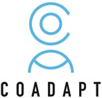
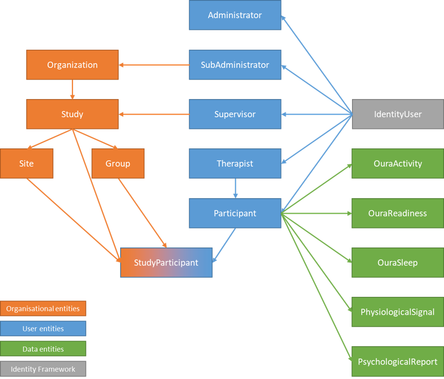

# COADAPT Platform

The [COADAPT project](https://coadapt-project.eu/) is releasing the code of its platform as open source under the [Apache License version 2.0](https://www.apache.org/licenses/LICENSE-2.0). The platform’s role is to collect participants’ data and offer them to the front-end applications that need them, while ensuring that these data are displayed on a need-to-know basis, i.e. by enforcing user roles.

The user roles implemented are part of the user management aspects of the platform. They dictate what administrators, sub-administrators, supervisors, therapists and participants can do, i.e. how they can interact with the collected data. These roles form the user tier of the user management data model. The roles are also associated with different organisational levels at the organization tier of the user management data model. These levels are the organisations, their studies, the sites where the later are run and the groups of participants. All these entities of the platform can be found in the Entities project, while the access to their stored instances in the database is established in the Repository project.

The platform exposes its functionalities via a REST API, whose code can be found in the UserManagement.WebAPI project.

The COADAPT team



## Implementation

The COADAPT platform is built using C# and the .Net Core 2.2 framework. The database hosting the user management and participant information data is MySQL, built with the Entity Framework and the “code first” approach.

To setup your installation of the platform, you need to add your database credentials for the development and production databases in appsettings.Development.json and appsettings.Production.json respectively:
```
"MySQLConnectionString": "server=localhost;userid=<Your DB user>;password=<Your DB password>;database=coadapt; Allow User Variables=true"
```
Then you need to use .NET Core EF to create the database from the migrations, running:
```
dotnet ef database update
```
from the terminal while in the COADAPT/UserManagement.WebAPI directory.

## Swagqer API interface
Upon running the COADAPT platform code, the API is exposed alongside a Swagger interface to explore this API. Since all endpoints are accessible depending on the role of the logged in user, one should start with the Identity controller endpoints to login. The platform is shipped with an administrator account (username admin@coadapt.eu and password a1!B2@c3# ).
The first step after logging in is to change the administrator password using the update endpoint for the administrator user. Leave the user name blank (unchanged) and type a new strong password (minimum 6 characters including lowercase, uppercase letters and numbers).

## Data model

The data model is as follows:
The entities in the COADAPT user management data model are depicted in below. They are split into three tiers:
- The COADAPT organizations tier contains the entities hosting the studies.
- The COADAPT users tier contains the entities of the different user types.
- The .NET Core Identity tier is managed by Identity to provide authentication and authorization.



### COADAPT organization tier

#### Organization
Organizations are responsible for (they own) a number of studies. There is a one-to-many relationship between organization and studies.
The organization entity has the primary key ID, the name and the short name attributes.

#### Study
Studies are run in a number of sites and their participants are split into a number of groups. There is a one-to-many relationship between study and sites and groups.
The study entity has the primary key ID, the name and the short name attributes.

#### Site
The site corresponds to a physical location (one of many) where the study takes place.
The site entity has the primary key ID, the name and the short name attributes.

#### Group
The group corresponds to a collection of participants grouped because they share some common properties, e.g. the type of treatment they undergo.
The group entity has the primary key ID, the name and the short name attributes.

### Identity entities tier
The entities instantiated by Identity are not to be detailed here. It suffices to know that users and roles are stored there.
Every COADAPT user of any type (administrator, sub-administrator, supervisor, therapist or participant) has an equivalent entry in the Identity user table (aspnetuser). Also, the types themselves are mapped to entries in the Identity role table (aspnetrole).

### COADAPT users tier

#### Administrator
Administrators own every entity of COADAPT, hence there is no need for connections to other entities. They perform CRUD operations on everything with the exception of deleting themselves.
The administrator primarily creates sub-administrators and organizations where the sub-administrators are assigned. Currently iSprint is envisioned for the single administrator. 
The administrator entity has the primary key ID, the Identity user ID and the date of creation attributes.

#### Sub-administrator
The sub-administrator can create and edit everything inside his organization, including supervisors. He assigns supervisors to studies.
A sub-administrator manages one and only one organization. Hence there is a one-to-one relationship between sub-administrators and organizations.
The sub-administrator entity has the primary key ID, the Identity user ID and the date of creation attributes.

#### Supervisor
Supervisors create therapists and participants and associate participants to therapists.
A supervisor manages its own studies. A study belongs to one and only one supervisor but a supervisor can supervise multiple studies. Hence, there is a one-to-many relationship between supervisor and studies.
The supervisor entity has the primary key ID, the Identity user ID and the date of creation attributes.

#### Therapist
A therapist can view information about assigned participants and if needed edit some information. Every therapist can be assigned participants in different sites, studies and organizations, hence is independent of them.
There is a one-to-many relationship between therapist and participants anywhere.
The therapist entity has the primary key ID, the Identity user ID and the date of creation attributes.

#### Participant
A participant is an ageing employee taking part in a COADAPT trial. Participants can view their personal information, described in Section 5.
A participant can participate in multiple studies. This participation happens via a single site per study the participant is part of. There is a many-to-many relationship between site and participants, with the added constraint of every site a participant is associated must be at a different study. This relationship is facilitated via the “siteparticipants” table.
A therapist should be assigned to a participant, but this assignment can be changed.
The participant entity in COADAPT is identified by a unique random code. The structure of this code is yet to be defined.
Apart from the code, the participant entity has as attributes the primary key ID, the Identity user ID, the therapist ID the date of creation and several quasi-static personal information.
The quasi-static personal information refers to attributes that can change, but COADAPT is not interested in keeping track of the history of their values.

#### Participant information
The participant personal information that change over time and whose history is important to COADAPT are part of the COADAPT participant information data model, containing information about the psychological and physiological state.
